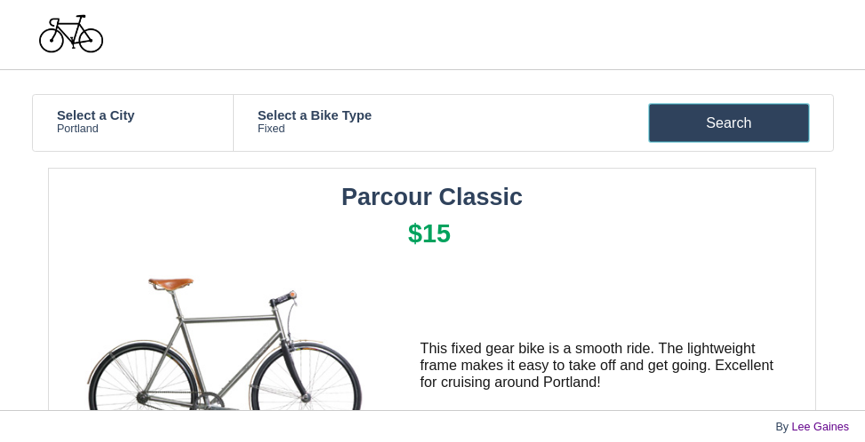

## Rent-a-Bike


#### Get Started
Run the web server on port 5000
```
RENTABIKE_MYSQL_USER=rentabike_dev RENTABIKE_MYSQL_PWD=password RENTABIKE_MYSQL_HOST=localhost RENTABIKE_MYSQL_DB=rentabike_dev_db RENTABIKE_TYPE_STORAGE=db python3 -m web_dynamic.webapp
```
Run the API server on port 5001
```
RENTABIKE_MYSQL_USER=rentabike_dev RENTABIKE_MYSQL_PWD=password RENTABIKE_MYSQL_HOST=localhost RENTABIKE_MYSQL_DB=rentabike_dev_db RENTABIKE_TYPE_STORAGE=db python3 -m api.v1.app
```

#### Environment Variables
Key | Options
--- | ---
`RENTABIKE_ENV` | 'dev' for development, 'test' for testing (drops all tables)
`RENTABIKE_TYPE_STORAGE` | 'db' for database, anything else for JSON file
`RENTABIKE_MYSQL_USER` | 'test' (drops all tables), or 'dev'
`RENTABIKE_MYSQL_PASSWORD` | 'password'
`RENTABIKE_MYSQL_HOST` | 'localhost'
`RENTABIKE_MYSQL_DB` | 'rentabike_dev_db' of 'rentabike_test_db'
`RENTABIKE_API_HOST` | '0.0.0.0' (configs in `api/v1/app.py`)
`RENTABIKE_API_PORT` | '5000' (configs in `api/v1/app.py`)

#### Console
The console is the administrative tool used for CRUD actions. Enter the console
with the following command:
```
RENTABIKE_MYSQL_USER=rentabike_dev RENTABIKE_MYSQL_PWD=password RENTABIKE_MYSQL_HOST=localhost RENTABIKE_MYSQL_DB=rentabike_dev_db RENTABIKE_TYPE_STORAGE=db ./console.py
```

#### Deployment
With Fabric. See `fabfile.py` for configuration settings.
```
# From the root folder of this directory
$ fab deploy -i <path-to-ssh-key>
```
`setup_web_servers.sh` is a bash script that installs nginx and configures the
server to work with the deployment via fabric.

#### Database
This application uses [MySQL 5.7](https://dev.mysql.com/doc/relnotes/mysql/5.7/en/). The file `setup_mysql_dev.sql` in the root
directory of this repository contains an SQL script that creates a database
called `rentabike_dev_db` and a user called `rentabike_dev`. The file
`setup_mysql_test.sql` does the same, except `dev` is `test`. The password for
both these users is 'password'. These values can be set for environment variable
keys.

To create the `rentabike_dev_db` and `rentabike_dev` user, run this command:
```
cat setup_mysql_dev.sql | mysql -hlocalhost -uroot -p
```

#### Unit Tests
Unit tests are located in the `/tests` directory. Before running the tests, make
sure none of the environment variables above are set. To run the full test suite,
enter the following command from the root directory of this repository:

```
python3 -m unittest discover tests
```
